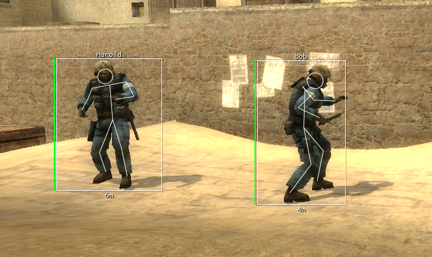
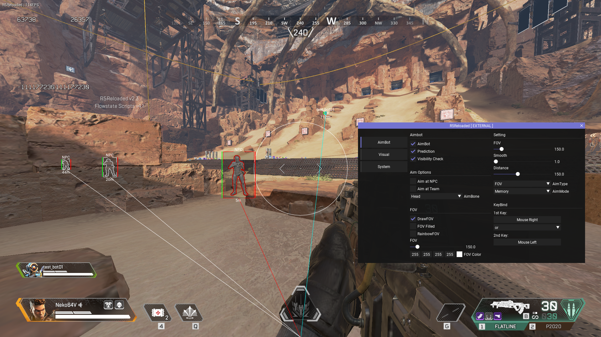
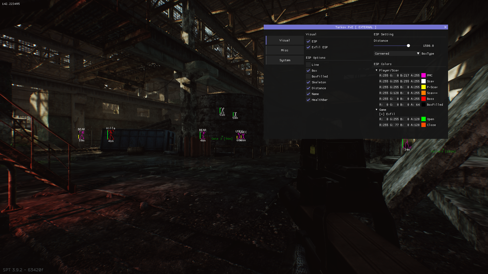

# 概要

## 前書き
近年、FPSゲームのチートは「絶対に触れてはいけないタブー的存在である」と見なされがちです。  
まあ実際部分的にそうではあるのですが、我々がチートに対し正しい認識で向き合っていかない限り変わらないものだってあるだろうなと思ってます。

「なんかよく分かんないけどとりあえず悪いものだから近づかないでおこう…」と、先入観だけで情報をシャットアウトするのもただの無関心なプレイヤーでいる分には自由です。この国には「言論の自由」「知る権利」「知らない権利」なんもでありますからね。

そんな無関心なプレイヤーはどうでもよくて、本記事がチートの機能や技術的仕様、その対策等を解説することでチートに対する適切な対策やチートを使用することのリスクを正しく認識してもらい、これからのFPSゲーム業界の発展の一助の1つになればと願っています。

## お前誰だよ
チート開発歴数年の弱者男性です。ちなみに学歴は底辺工業高校卒。終わっとるね。  
重要なものは公開していませんが、割とどうでもいいやつはGitHubに上げてます。見てね💕

## 概要
FPSゲームでのチート行為とは、FPSゲームにおいて開発者が想定していない不正な外部のソフトウェアやディバイスといったものを使用して他のプレイヤーに対し不正に優位に立つことであり、それらを使用するプレイヤーのことを「チーター (Cheater)」という。
対人FPSゲームの誕生から現代に至るまで、正規のゲーマーに最も嫌われる行為の1つである。

## 定義
上で述べた通り、本ドキュメントではチートを「FPSゲームにおいて開発者が想定していない外部のソフトウェアやディバイスといったものを用いて他のプレイヤーに対し不正に優位に立つこと、またそれに使われるツールのこと」と定義する。

## 実際のチートの画像
###  典型的なウォールハック

CounterStrike: Source

### ApexLegendsでの例

R5Reloaded (Modded ApexLegends)

### Escape from Tarkovでの例

SPT-AKI (Modded Escape from Tarkov)

※ いずれもローカルのオフラインサーバーで作成/テスト/撮影